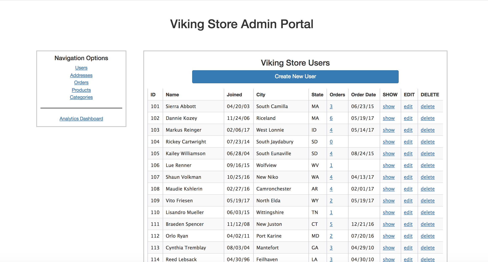
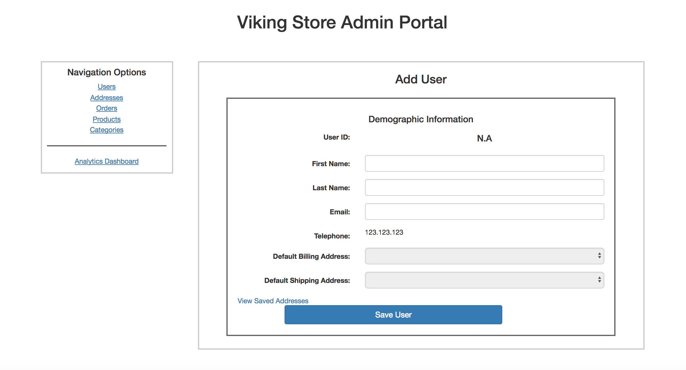
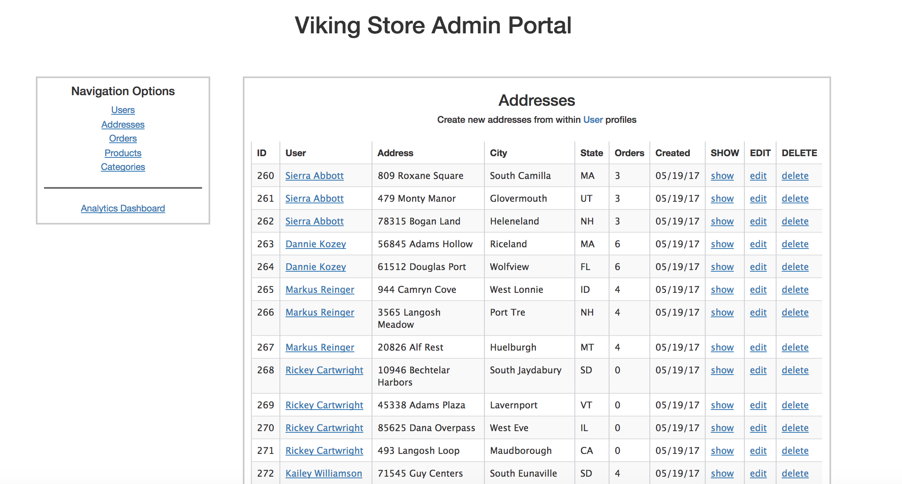
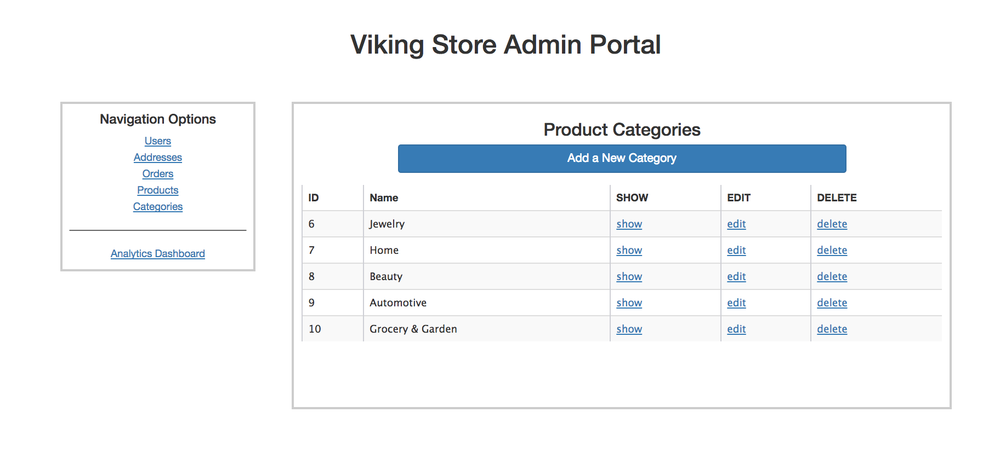
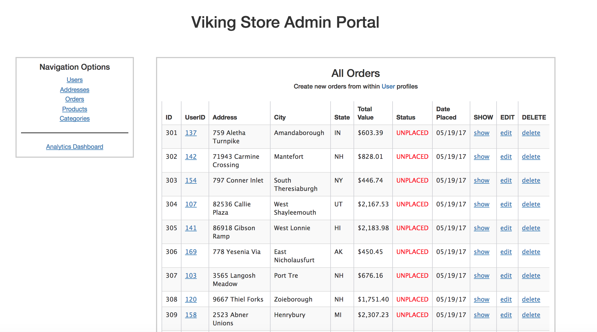
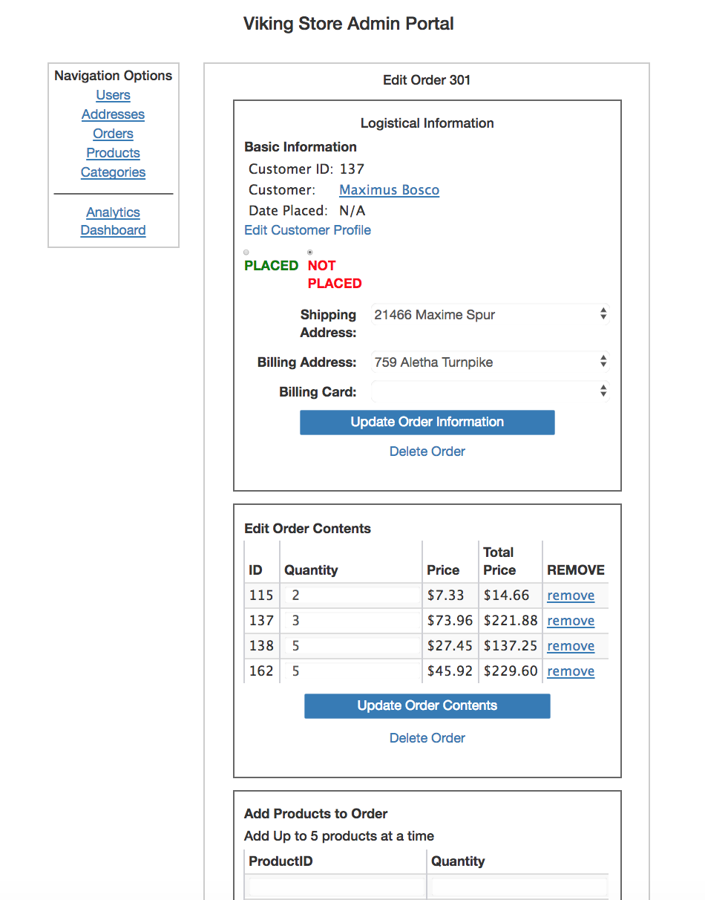
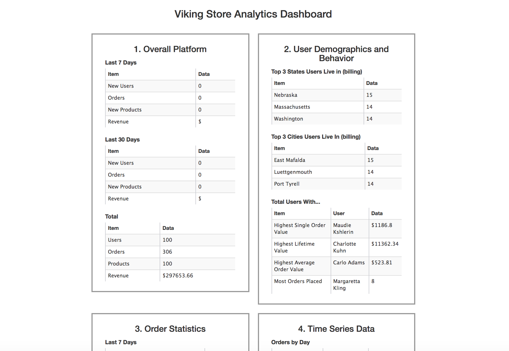

# Project Viking Store - Admin (plus tests in RSpec )
========================

Viking Store Admin is rails web application designed for shop owners. It is the back office, administration view into the e-store. This way, the owner can see users who signed up, their addresses, orders, can edit their data or order details (ie. when customer called to change the order he already placed, the owner can add additional products to their orders, cancel them, change shipping or billing address). There are two types of addresses - billing and shipping and although user can add many addresses to the database, there is only one default shipping and default billing address. The store owner can also add products, categories if his store gets new products in. The Dashboard holds statistics about all orders in the past month or a year (or revenue or average value of orders), all users who signed up and basic demographic data about them, or number of orders on particular days.

## About the author
[Dariusz Biskupski](http://dariuszbiskupski.com/)

## Getting Started

Live version of the app available on Heroku -> here:
[Viking Store Admin Portal LIVE ](https://sheltered-sea-58865.herokuapp.com/)


### Overview


**All the customers that shop owner can view, check details of their profile, their orders, edit their profile or even delete... **



**   Here admin can add new user (shipping address can be added in addresses)  **



**   Here admin can edit existing addresses, once in edit page, he can set billing and shipping address   **



**   Here admin can add, edit, delete product catergories   **


**   List of orders that can be edited, placed, accessed for more details ect.   **


**  Here id the edit page of the certain order. Shipping address can be edited, billing cards number. Admin can add products to the order or edit existing one.   **



**   Here the admin can check statistics of the online sales, users demographics etc.   **


**   And much more than that, please check the live version on: [Viking Store Admin Portal](https://sheltered-sea-58865.herokuapp.com/)  **

### Installing

To get the app started locally you'll need to:

1. Clone the repo with `git clone REPO_URL`
1. `cd` into the project
1. Run
  - `$ bundle install`
  - `$ bundle exec rake db:migrate`
  - `$ bundle exec rake db:seed`
(# take a look around the schema file to see how models were created)

1. Start up the server with `rails s` command and visit `http://localhost:3000` in your browser

## Running the tests

A big part of the functionality is covered by rspec tests which can be run with following command:
```
bundle exec rspec
```

## Acknowledgments

* I would like to thank to The Viking Code School for big help in advancing with this application, as well as to my mentor Holman Gao who helped me with stumbling challenges on the way. Last, but not the least - big thank you to [https://stackoverflow.com](https://enigmatic-earth-17108.herokuapp.com).
